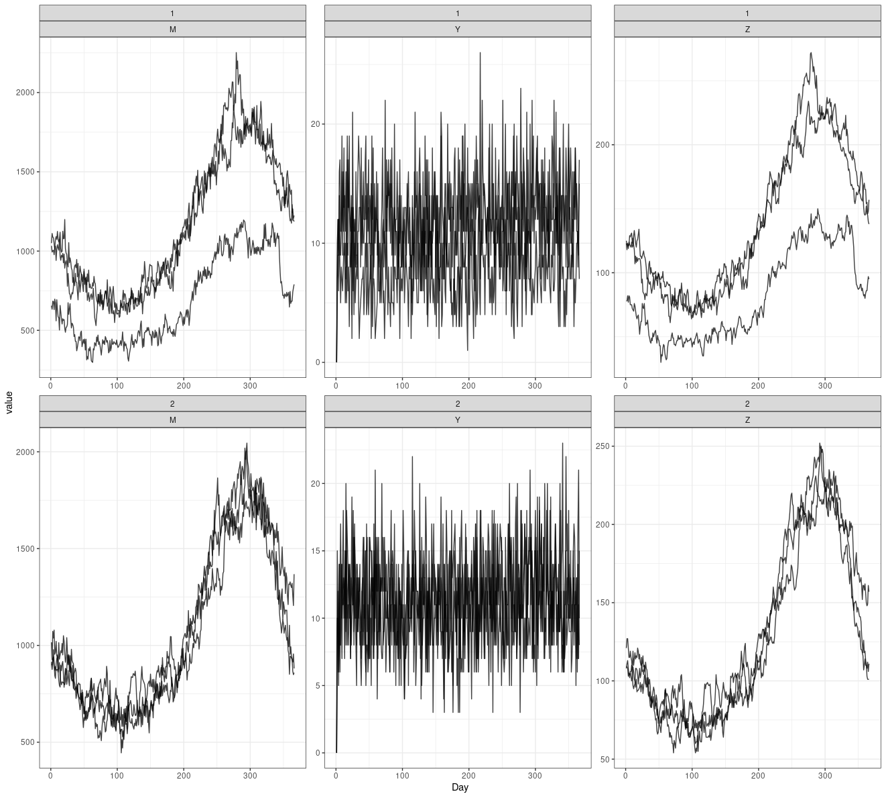

# MicroMoB-connector

This runs [MicroMoB](https://github.com/dd-harp/MicroMoB) using the Beverton-Holt
model of aquatic mosquito dynamics and the Ross-Macdonald model of adult mosquito
dynamics for use in the Model Runner.

The sample parameters were made with:

```R
p <- 2
tmax <- 365

surv_a <- 0.9

adult_stochastic <- TRUE
adult_f <- 0.3
adult_q <- 0.9
adult_eip <- rep(10, tmax)

mu <- log(1 / surv_a)
adult_p <- t(replicate(n = p, expr = {pexp((sin((1:tmax)/365*2*pi) + 2)/2 * mu, lower.tail = FALSE)}))
adult_psi <- diag(p)
adult_nu <- 25
adult_M <- rpois(n = p, lambda = 100)
adult_Y <- rep(0, times = p)
adult_Z <- rep(0, times = p)

molt <- 0.1
surv <- 0.9

aqua_stochastic <- TRUE
aqua_molt <- matrix(data = molt, nrow = p, ncol = tmax)
aqua_surv <- matrix(data = surv, nrow = p, ncol = tmax)

lambda <- adult_M*(1-surv_a)
eggs <- adult_nu * adult_f * adult_M

aqua_L <- lambda * ((1/molt) - 1) + eggs
aqua_K <- - (lambda * aqua_L) / (lambda - aqua_L*molt*surv)
aqua_K <- t(sapply(X = aqua_K, FUN = function(x) {rep(x, tmax)}))

input <- list(
  p = p,
  tmax = tmax,
  aqua_stochastic = aqua_stochastic,
  aqua_molt = aqua_molt,
  aqua_surv = aqua_surv,
  aqua_K = aqua_K,
  aqua_L = aqua_L,
  adult_stochastic = adult_stochastic,
  adult_f = adult_f,
  adult_q = adult_q,
  adult_eip = adult_eip,
  adult_p = adult_p,
  adult_psi = adult_psi,
  adult_nu = adult_nu,
  adult_M = adult_M,
  adult_Y = adult_Y,
  adult_Z = adult_Z
)

jsonlite::write_json(x = input, path = "test/input.json",digits=17,pretty=TRUE)
jsonvalidate::json_validate(json = "test/input.json", schema = "schema/MicroMoB.json")
```

You can read in and plot the output in R to check everything is working correctly with:

```R
library(data.table)
library(ggplot2)

output <- jsonlite::read_json(path = "output/data.json", simplifyVector = TRUE)

MYZ <- as.data.table(output$MYZ)
data.table::setnames(x = MYZ, old = c("V1", "V2", "V3"), new = c("Patch", "Day", "Stage"))

MYZ[,
    Stage := fcase(
      Stage == 1, "M",
      Stage == 2, "Y",
      Stage == 3, "Z"
    )]

ggplot(data = MYZ) +
  geom_line(aes(x = Day, y = value, group = Patch), alpha = 0.75) +
  facet_wrap(. ~ Stage, scales = "free") +
  theme_bw()
```

You should see output which resembles the following plot, although if you used stochastic
model(s) there will be sampling variation.


